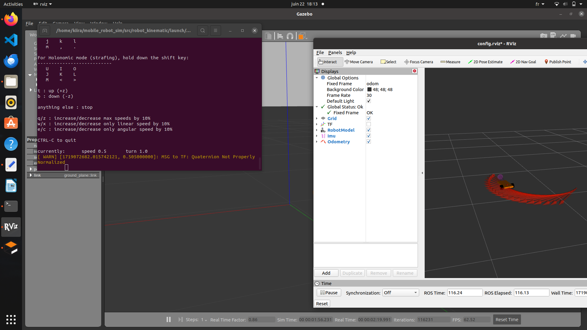
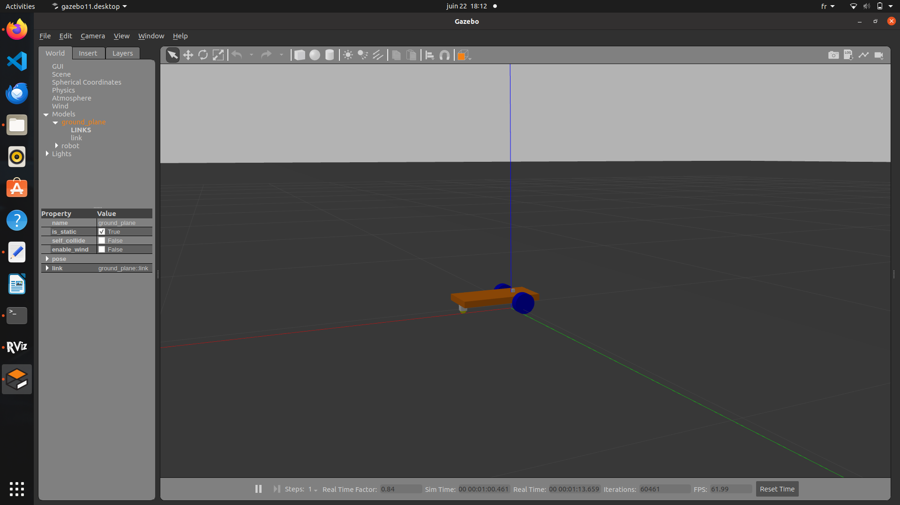

# Simple Differential Drive Mobile Robot Simulation

Welcome to the simple differential drive mobile robot simulation tutorial! This repository provides a basic simulation setup using ROS (Robot Operating System) and Gazebo for simulating a differential drive robot with various functionalities.



## Overview

In this simulation, we utilize ROS and Gazebo to simulate a differential drive mobile robot. The main components and functionalities included are:

- **Joint Velocity Control**: Each wheel is controlled using a `joint_velocity_controller` to simulate movement.
  
- **Odometry Calculation**: The robot's odometry is computed from the joint states of each wheel, facilitated by the `gazebo_ros_control` plugin (`DefaultRobotHWSim`).

- **Teleoperation**: Control the robot's movement via the `teleop_twist_keyboard` commands published on the `/cmd_vel` topic.

- **Visualization**: Visualize the robot's actual position in real-time using Rviz, based on the calculated odometry.

- **IMU Integration**: An IMU plugin is included to enhance odometry accuracy. Future plans may involve integrating this data with the `robot_localization` package for improved localization (this could be implemented in a separate repository or branch).

## Setup

To run the simulation on your local machine, ensure you have the following prerequisites installed:

- ROS Noetic
- Gazebo
- Rviz
- `teleop_twist_keyboard` package

Clone this repository into your ROS workspace and build it:

```bash
cd ~
git clone https://github.com/ChehabiMed/Mobile-robot-simulation-ROS
cd ..
catkin_make 
source devel/setup.bash
```

## Running the Simulation

Launch the simulation environment:

```bash
roslaunch robot_kinematic robot_kinematic.launch 
```




## Future Enhancements

Future updates may include:

- Implementing `robot_localization` for sensor fusion with IMU data (already implemented in the [Mobile-robot-simulation-ROS repository](https://github.com/ChehabiMed/mobile-robot-localization-ROS) .
- Adding meshes and your stl model to make the robot looking good.
- Adding sterio camera plugin and extracting visual odometry from it to fuse it with other data.
- Building a map from sterio vision.

## Contributing

Contributions to this repository are welcome! If you have suggestions, improvements, or bug fixes, feel free to open an issue or submit a pull request.


##License

This project is licensed under the BSD 2-Clause "Simplified" License. See the LICENSE file for details.

